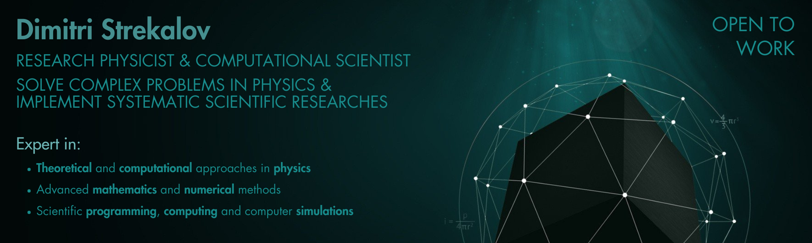

### Hello! 👋 I am Dimitri, a committed scientist and a programmer specializing in theoretical, mathematical and computational frameworks in physics

## 📜 &nbsp; About me and my GitHub:

* Though **my primary concern is physics**, I still highly engaged in developing processes related to scientific
programming and computing, mathematical modeling and computer simulations.

* Mathematical modeling and related processes play pivotal roles in **modern scientific research processes**.
These models are essential tools that help researchers understand complex systems, predict outcomes, and explore new
hypotheses in ways that traditional experimental methods cannot (the animation is one of the most famous examples).

* **My GitHub is a showcase of my core mathematical and programming tools** which I utilize in my research activities.
It is structured into a core “source” repository named [**MathTools**](https://github.com/StDLabs/MathTools) and other
connected project repositories. The main MathTools repository can be treated as a library of tools and a foundation for
the use of modular programming technique. The other repositories are more like **showrooms for particular projects**
mostly utilizing MathTools modules and scripts.

* If you wish to know more about my major **scientific activities**, you could visit my LinkedIn profile,
where I present more relevant content as a physicist and a researcher. Feel free to contact me with any questions
directly if you have any, I will be glad to answer.

## 🛰 &nbsp; Scientific Programming Skills:

&nbsp;

&nbsp;

## 🛰 &nbsp; Environments and Software:

&nbsp;
&nbsp;
&nbsp;
&nbsp;
&nbsp;

